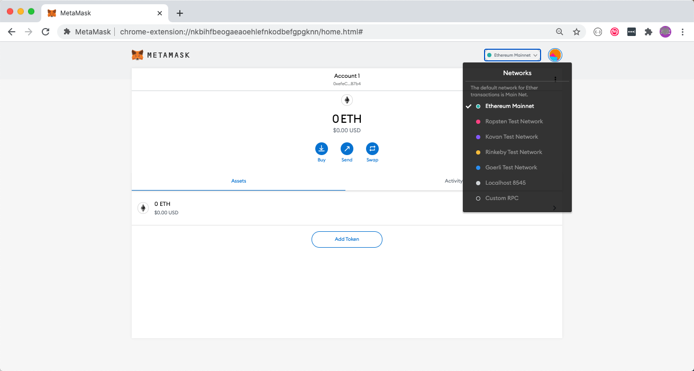
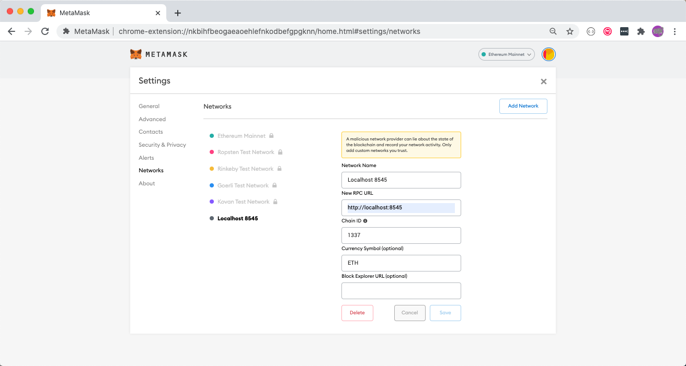
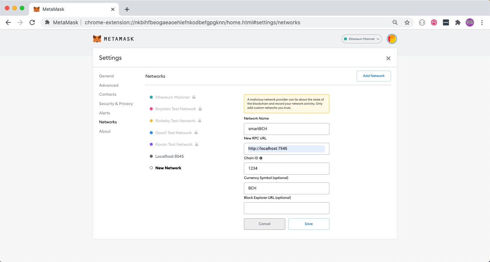
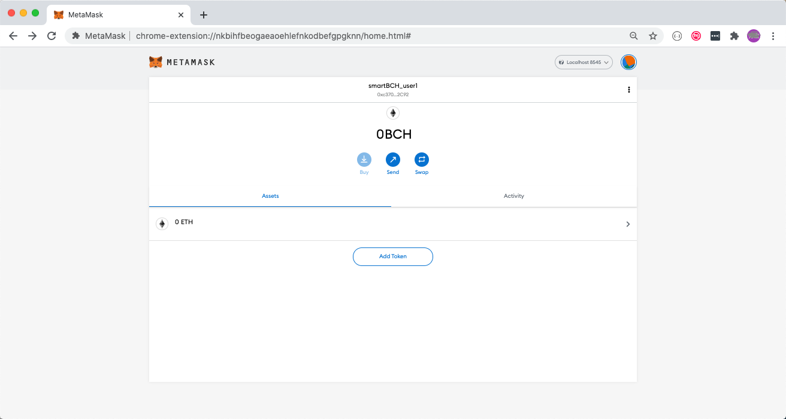
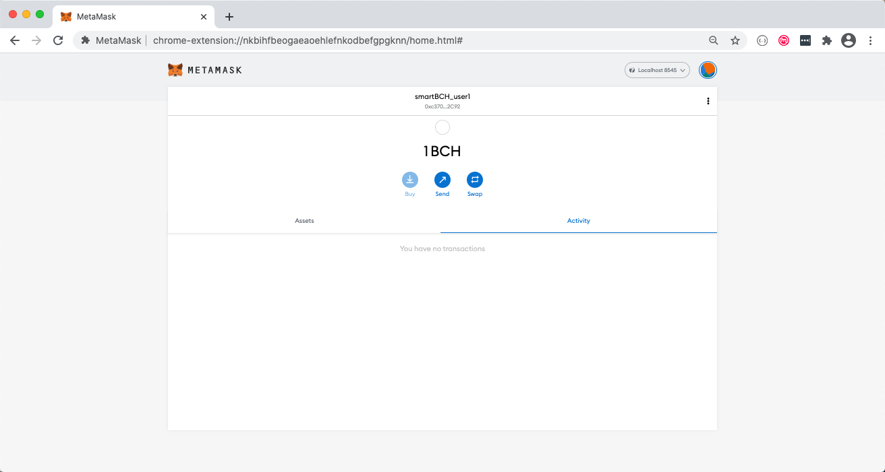
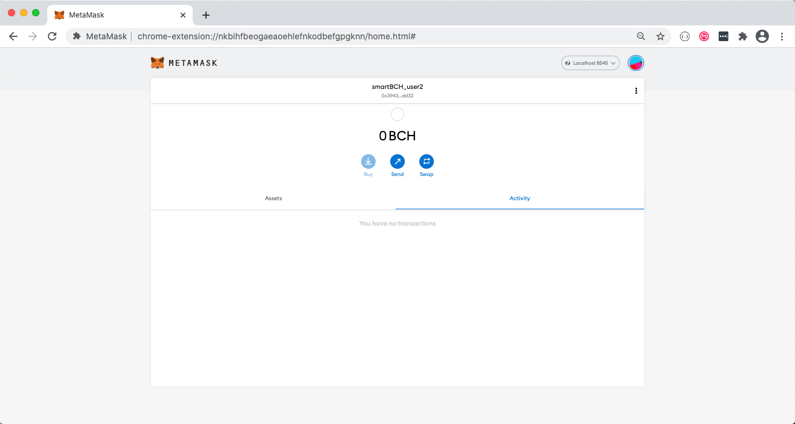
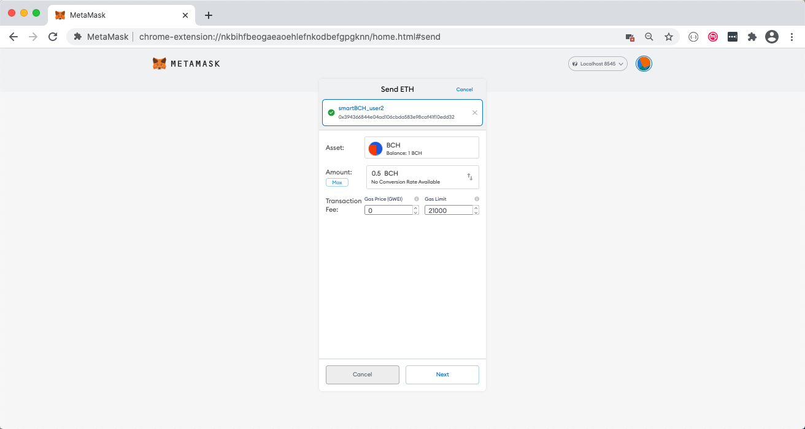
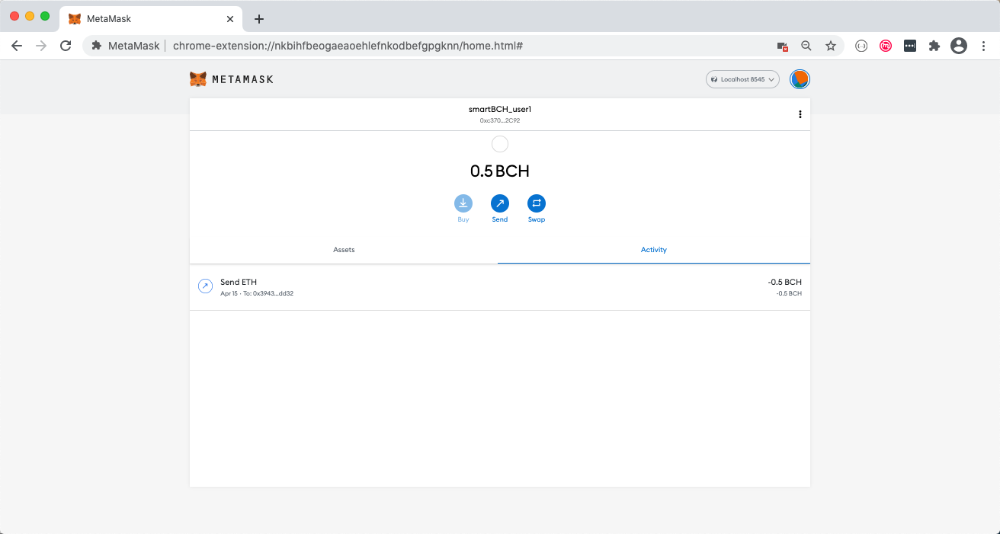
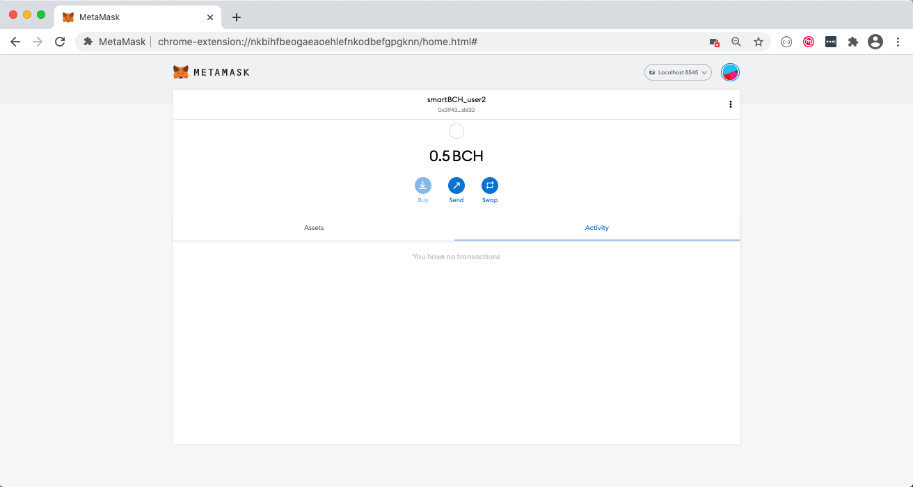

# Test smartBCH using MetaMask

In this article, we will show how to test smartBCH single-testing-node using MetaMask. We use Chrome browser as example but Firefox browser should work the same way.


## Start smartBCH single-testing-node

Please flow [this doc](runsinglenode.md) to start smartBCH single testing node. When the testing node is started with default options, it will serve JSON-RPC on localhost:8485. You can use the following cmd to check that the node works well and to see the testing accounts:

```bash
$ curl -X POST --data '{"jsonrpc":"2.0", "method":"eth_accounts", "params":[],"id":1}' \
    -H "Content-Type: application/json" http://localhost:8545 | jq
```

The output looks like this:

```json
{
  "jsonrpc": "2.0",
  "id": 1,
  "result": [
    "0x876367b14fe2c725ed4bfc4ace406ea53db58d0f",
    "0x8c1fe0ad5e59d72ffd064ff80e0c605530af8806",
    "0xa321e9ca672fb04b3c57160f93a40b70fb3f1d6b",
    "0xa6f8d15b18b2b93cbf7fae192184ccd9e03bfaf4",
    "0xb77f11af5206fdfd87011744ea1c0b3bf77ca4ec",
    "0xc38a47a2481bc692c2203e7e7e5e73c474bea43c",
    "0xd5fd2c57069d93b6ce3126275a288d21b8aa2e87",
    "0xdc7c3b6c76eed26bf224a9f1a300b79ce8bc68b2",
    "0xf995503a428d2deaeb53075dc0476affeee95f05",
    "0xfb2c39aafd37c6d17e16b73cc8601f77ed5586b9"
  ]
}
```


## Config MetaMask networks

Install MetaMask into your browser, create or import a wallet, and than add a network configuration:



If you started smartBCH testing node on localhost:8545 for JSON-RPC, it happens that MetaMask has a preconfigured Network that matched this RPC URL:

 

But the chain ID may not match, in that case, you can replace 1337 with your smartBCH chain ID. And it's better that you change Currency Symbol to BCH. You can also add a new Network configuration like this:




## Create a new account

Create a new account in MetaMask, and let's name it smartBCH_user1. This newly created account have no BCH (the native token of smartBCH) of cause:



We can transfer 1 BCH to this account using cmd like this:

```bash
$ curl -X POST --data '{
  "jsonrpc": "2.0",
  "method": "eth_sendTransaction",
  "params":[{
    "from": "0xd5fd2c57069d93b6ce3126275a288d21b8aa2e87",
    "to": "0xc370743331B37d3C6D0Ee798B3918f6561Af2C92",
    "gasPrice": "0x0",
    "value": "0xDE0B6B3A7640000"
  }],
  "id":1}' -H "Content-Type: application/json" http://localhost:8545
```

The `from` address comes from output of `eth_accounts` RPC. The `to` address is copied from MetaMask by clicking the account name. The `value` is amount of BCH to send in HEX, and is amplified by 10<sup>18</sup>. Just like ETH, 1 BCH on smartBCH chain can be divided into 10<sup>18</sup> units. The output looks like this:

```json
{"jsonrpc":"2.0","id":1,"result":"0x40f6c7d7e350f295d000520b1a820f4b22535524a7e71b279dff45b2c60ce2c8"}
```

Wait a second, and you can check that your account has received 1 BCH:




## Transfer BCH using MetaMask

Let's create another new account and name it smartBCH_user2:



We can transfer/send to smartBCH_user2 some BCH from smartBCH_user1:




A few seconds later, the balance of smartBCH_user1 and smartBCH_user2 should be updated:





Congratulations! You just started smartBCH single-testing node and tested it with the most popular browser wallet MetaMask. If you are new to MetaMask, you can read it's help docs [here](https://metamask.zendesk.com/hc/en-us).

