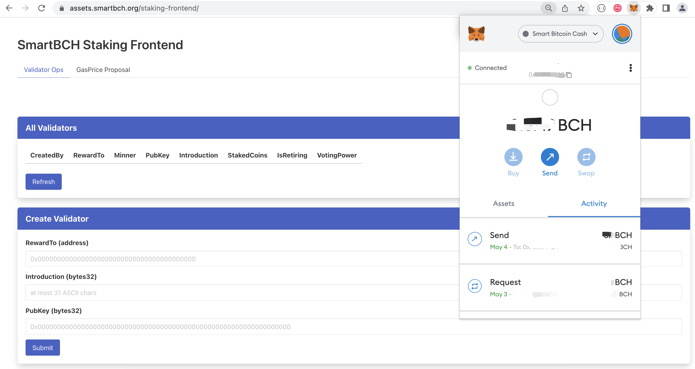
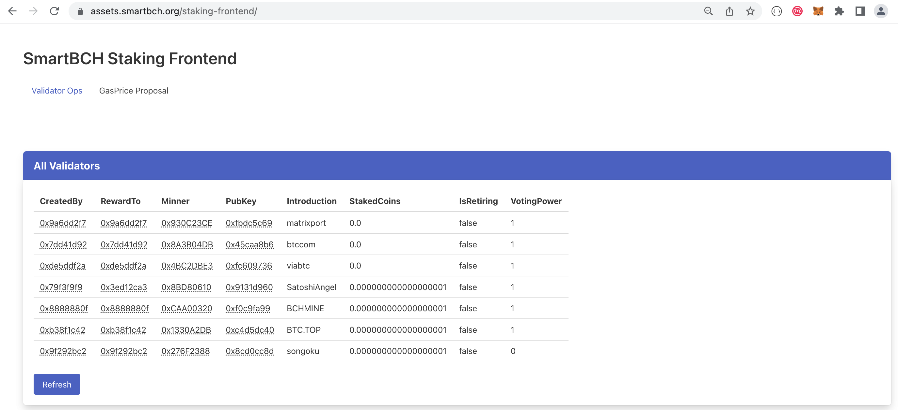
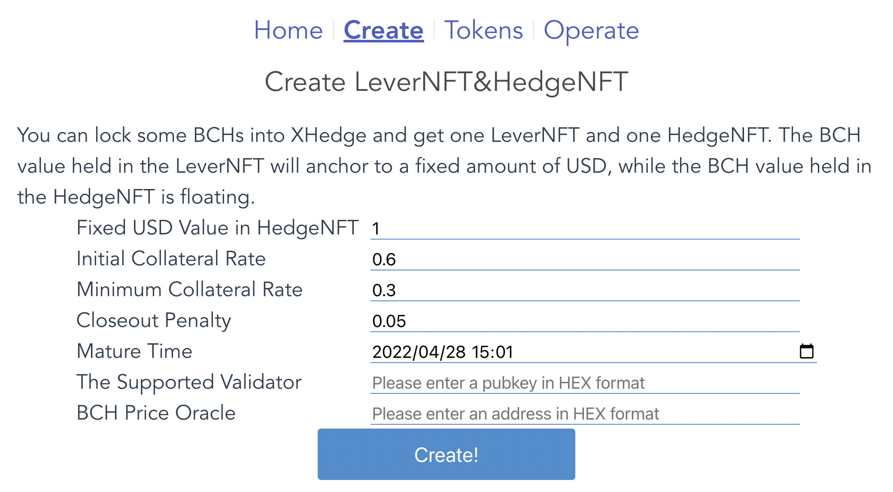
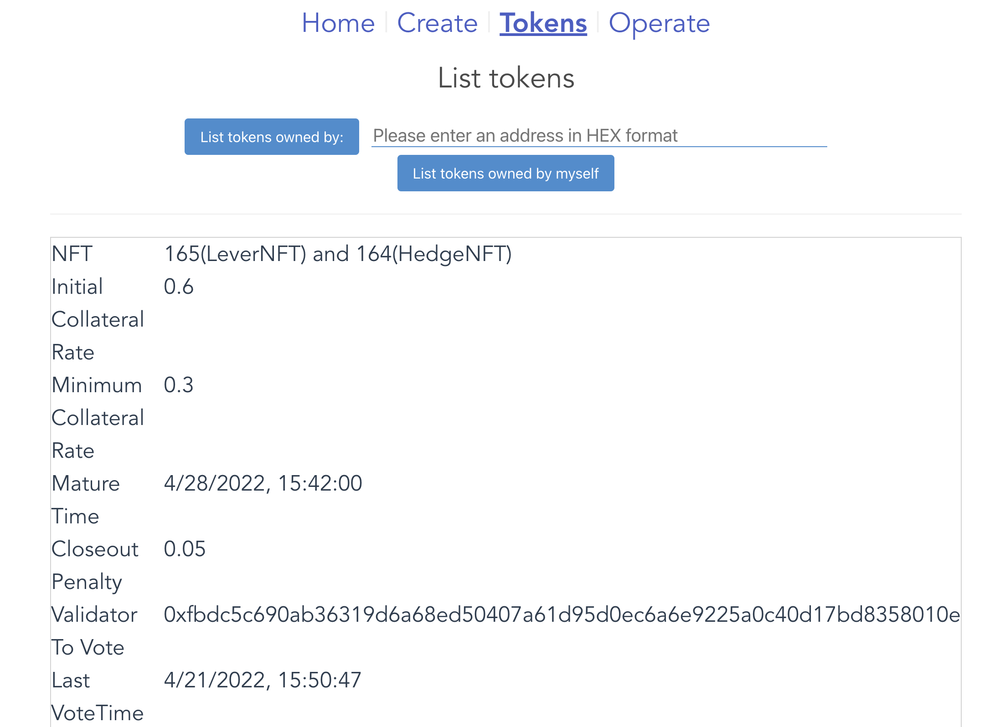
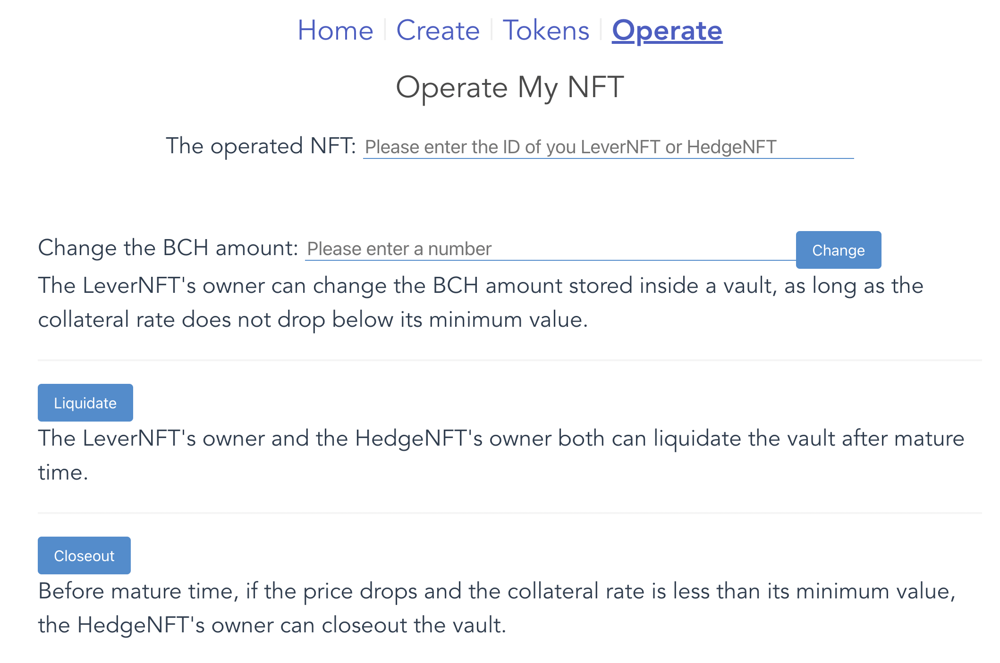

## How to be validator through POS

If you are already a validator, skip directly to step 3

#### Step 1: create new validator

**First, generate validator consensus key.**

```
./smartbchd generate-consensus-key-info | tee generate-consensus-key-info.txt
```

The output hex string is consensus pubkey which will be used in command below, and a file containing the consensus public and private key is generated under the current directory, named `priv_validator_key.json`.

Please copy the `priv_validator_key.json` to your work dir: `.smartbchd/config/`. Then restart you smartbch node.

Next, we can register our new validator through CLI or Web frontend.


#### Step 2a: Register new validator through CLI

**Then, you can use these key information to build command below:**

```
./smartbchd staking \
--validator-key=<your validator account private key in hex string format> \
--staking-coin=1 \
--consensus-pubkey=<your validator consensus pub key> \
--introduction=<your validator introduction> \
--type=create \
--nonce=<your validator account nonce> \
--gas-price=1250000000 \
--chain-id=0x2710
```

This command will output a hex string to be used in the next step.

**Then, send transaction to register as a validator**

Make sure you have enough BCH in you validator account.

Then broadcast the transaction (replace `your_tx_data` with what hex string get above):

```
curl -X POST --data '{"jsonrpc":"2.0","method":"eth_sendRawTransaction","params":["you_tx_data"],"id":1}' -H "Content-Type: application/json" http://localhost:8545
```

OK, now you had send a `createValidator` transaction to the staking contract. Check this transaction's receipt (replace `your_tx_hash` with what the hex string you get in above command):

```
curl -X POST --data '{"jsonrpc":"2.0","method":"eth_getTransactionReceipt","params":["your_tx_hash"],"id":1}' -H "Content-Type: application/json" http://localhost:8545
```

If the `status` is `0x1`, congratulations, your validator is created now, but it has no voting power now.


#### Step 2b: Register new validator through Web frontend

Alternatively, you can register new validator through smartbch's staking frontend. Go to https://assets.smartbch.org/staking-frontend/ , connect this app with your validator account through MetaMask:



In "Create Validator" box，enter "RewardTo" address (normally, it should be the connected address of MetaMask), "Introduction" and "PubKey" (generated at step 1), the "staking-coin" is 1 Wei. Then click "Submit" button to finish the registration. Then, you can click "Refresh" button in "All Validators" box to see all validators. Your newlly registered validator should be listed:




#### Step 3: Vote the validator in XHedge contract

**Please goto https://xhedge.cash/ to operate. Click the Create tag.**



This is the create NFTs page. you can change the default data by yourself.

Please fill in the validator public key generated in Step 1 and the BCH oracle address. And change the `Fixed USD Value in HedgeNFT` to your target amount. Then click the `Create!` button. Note that the "Fixed USD Value in HedgeNFT" should not be too small, we recommend at least a value greater than 3 BCH.

**After transaction minted by smartbch chain, click the `Tokens` tag. Click `List tokens owned by myself`to show NFTs just created in above operation.**



The NFT token id can be found on first line in NFT content, copy it.

Click `Operate` tag.



Please fill in the NFT token id listed below and click `Vote` button. After transction has been minted, vote is done successfully.

When the new epoch in smartbch chain has switched, validator has been voted will be active to participate block mint if the total number of validators not hit the upper limit.


### More Info about smartBCH

More detail info about XHedge contract refer to: https://docs.smartbch.org/smartbch/developers-guide/xhedge-contract

How to run a smartbchd node refer to: https://docs.smartbch.org/smartbch/mainnet