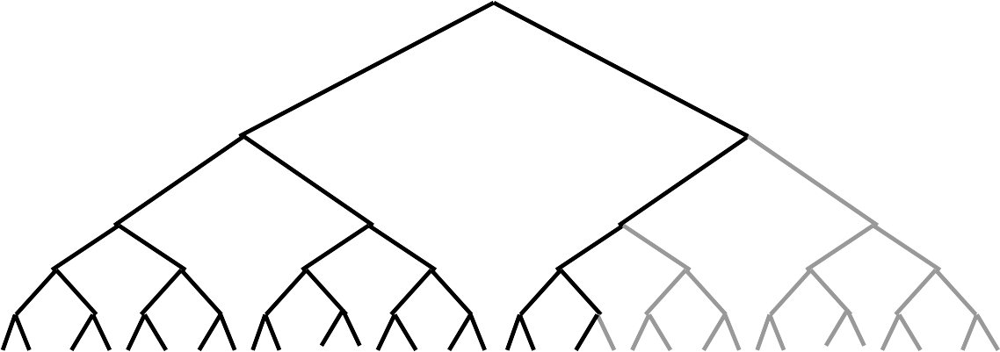
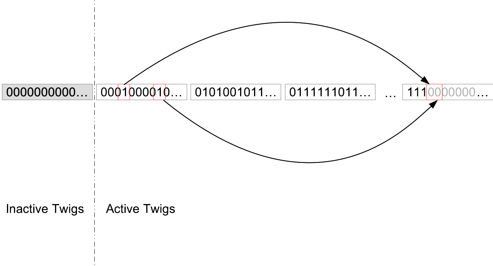

# MoeingADS's General Ideas

## 1.0 In the whole history of a blockchain, how can we prove which KV pairs were created/updated at which blocks?

When a Key-Value pair is created/updated at a block of Height, we create such an Entry:

```text
Entry := (Height, Key, Value, SerialNum)
```

Through the history of the blockchain, we get a sequence of such entries. The SerialNum field shows an entry's postion in this sequence.

Then we build a balanced binary Merkle tree, with hash values of these entries as leaves. If the count of entries is not $2^N$, we just add null entries for padding, as is shown below \(the null entries are grey\).



Using the binary tree, we can prove the existence of an individual entry.

Of cause, in the implementation, we do not really add null entries for padding. Instead, we only need to add a null node at each level of the binary tree, as is shown below.


## 2.0 How to store such a Merkle tree

If we keep the whole Merkle tree in DRAM, then we can provide the proofs very fast. But unfortunately, it will cost a huge amount of DRAM so it is not feasible. A reasonable trade-off is: since the upper levels is more likely to get accessed than the lower levels, we can keep the upper levels in DRAM and the lower levels on hard disk.

In the current golang implementation of MoeingADS, we store the lowest 11 levels of nodes \(which correspond to 2048 entries\) on hard disk, as is shown below. Such a small sub-tree with 11 levels of nodes are named as a "twig". The youngest twig \(in the read circle\) has not got all its internal nodes fixed, since the 2048 entries are not decided yet. So we buffer this youngest twig in DRAM. All the other twigs are stored on hard disk.


## 3.0 How to prove a KV-pair is up-to-date? In other words, since some height H, an KV-pair is left untouched \(not changed or deleted\).

An ActiveBit is attached to each entry. If ActiveBit==1, then this KV-pair is up-to-date; if ActiveBit==0, then this KV-pair has been changed or deleted after the height recorded in the entry.

These ActiveBits need to be random-accessed, because an ActiveBits can be cleared to zero at any time. So we must keep all the ActiveBits in DRAM.

## 4.0 Should we build a dedicated Merkle tree for these ActiveBits?

Although we do want to provide Merkle proofs for some individual ActiveBit, a dedicated Merkle tree is not necessary. A more memory-efficient implementation is to integrate the ActiveBits into a twig. That is, a twig contains 2048 entries and the corresponded 2048 ActiveBits.

The small Merkle tree inside a twig now is made of two parts, as is shown below. The left part is a eleven-level tree with 2048 entries as its leaves. And the right part is a three-level tree with 8 leaves. Each leave contains 256 ActiveBits. And the Merkle root of the entire twig, i.e. TwigRoot as is shown below, is a hash value calculated from the roots of left part and right part.


## 5.0 How to prune the ActiveBits and entries?

We want to keep only the recent entries whose ActiveBits equal 1, and prune the old ones to save memory. But currently we can not make sure that the old enough entries are inactive \(i.e. having their ActiveBits==0\). Actually, even the oldest entries may be still active.

We have a counter measure: repeating redundant updates. We fetch the oldest entries and overwrite their value using exactly the same values. Thus new entries are created and the oldest entries are deactived.

The following picture shows a "redundant update" operation. Two oldest active entries \(in the two red rectangles on the left side\) are fetched out and two new entries are generated \(in the red rectangle on the right side\). Then the ActiveBits of the oldest entries are cleared to 0 and the ActiveBits and the newly-created entries are set to 1.

Using this method, we can ensure the old enough entries are deactived if their SerialNums are less than a particular value. The twigs whose entries' SerialNums are all less than this particular value are refered to as "inactive twigs", or else "active twigs". an inactive twig has all its ActiveBits==0. Please note an active twig can also has all its ActiveBits==0. We say a twig is "active" only because it MAY have ActiveBits==1.



## 6.0 How to provide non-existence proof? That is, we want to prove there are no other key\(s\) residing between key A and key B.

We need to extend entries with a NextKey field:

```text
Entry := (Height, Key, NextKey, Value, SerialNum)
```

After Height, if some events happened between Key and NextKey \(deletion, overwriting and insertion\), then this entry is sure to be deactived and a new entry will be created.

## 7.0 How to proof a KV pair at any height? Even if at this height nothing happens on this KV pair.

Now, using the information in entries, we can prove at height H0 and height H, a KV-pair was created or updated. But we can not prove that nothing happened between H0 and H.

So we need to extend entries with a new field "LastHeight":

```text
Entry := (Height, LastHeight, Key, NextKey, Value, SerialNum)
```

The information in an entry show:

1. At `Height`, the `Key`'s value is `Value`
2. There are no other keys between `Key` and `NextKey`
3. During `LastHeight` to `Height`, nothing happened between `Key` and `NextKey`

## 8.0 What are the possible statuses of twigs.

We can describe a twig's status using several terms.


First term: "Youngest". There is only one youngest twig \(the green one in the above figure\). A youngest twig has null entries. When all the 2048 entries are ready, it is no longer a youngest twig. Another twig with 2048 null entries will be created as the new youngest twig. Youngest twig is the only twig whose left eleven-level Merkle tree is stored in DRAM. For the other twigs, the left eleven-level Merkle trees are stored in hard disk.

Second term: "Active". An active twig contains at least one active entry, or there is at least one entry which is older than this twig. A youngest twig is certainly active. In the above figure, the blue and green triangles are active twigs. The active twigs use DRAM to store their right three-level Merkle trees whose leaves are the ActiveBits, such that these bits can be cleared at any time.

Third term: "Pruned". The inactive twigs can be kept in hard disk such that we can query about the historical KV-pairs of the blockchain. They can also be pruned if we not interested in these historical old KV-pairs. A non-pruned inactive twig is kept in hard disk, and a pruned inactive twig is deleted from the hard disk. In the above figure, the black triangles are non-pruned twigs and the orange triangles are pruned twigs.

A twig can be in one of four possible states:

1. Active and youngest
2. Active and non-youngest
3. Inactive and not-pruned
4. Inactive and pruned

## 9.0  How to query a KV pair fast?

We can build an index, which maps a \(key, height\) tuple to a 64-bit integer, which is the offset of the entry in file. If you want to know the latest value of the key, just set height to -1.

This index must support iterator, so hash tables do not work. We must use some tree structure, such as red-black tree \(in DRAM\), B/B+ tree \(in DRAM or in disk\), LSM tree \(in disk\). To balance speed and memory consumption, we use B-tree in DRAM to index the latest keys \(height = -1\) and RocksDB to index the historical keys. RocksDB supports pruning. It can prune the records whose height is old enough, during compaction.

## 10.0 How to prune the inactive twigs?

A block at height H can create one or more entries. The SerialNum of the first entry created by it is denoted as SerialNum\(H\). When we do not need the information about the blocks older than H, we can prune the twigs whose entries' SerialNum are smaller than SerialNum\(H\).

Filesystem does not support truncate a file from the beginning to a middle point. So we must use a series of small files to simulate one large file. Pruning the from the beginning is deleting the first several small files. We name such a virtual large file as "head-prunable" file.

The content of twigs are seperated and store in two head-prunable files: one for the leaves, i.ie. the entries, and the other for the left eleven-level Merkle tree. What about the right three-level Merkle tree? Well, for the inactive twigs, all the ActiveBits are zero, so the right three-level Merkle trees are the same.

The left eleven-level Merkle trees occupies constant bytes on disk. So it is easy to calculate any node's offset in file.

